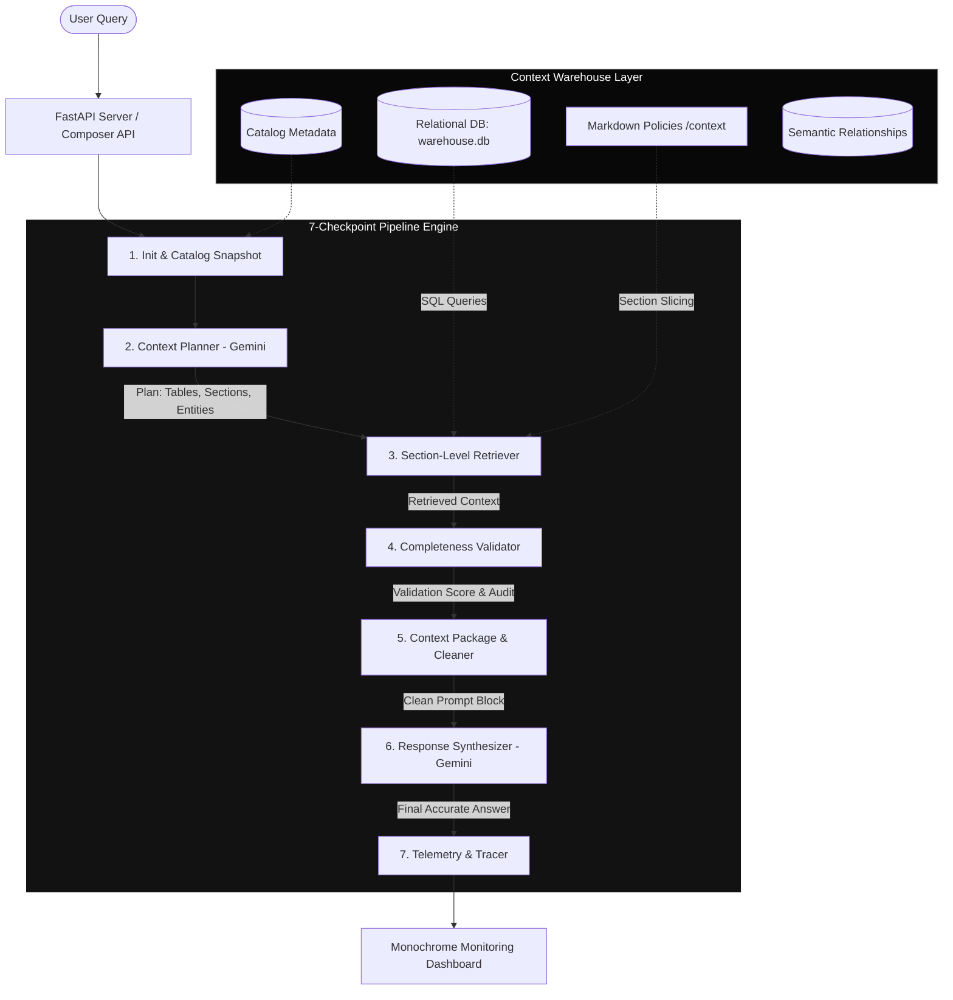
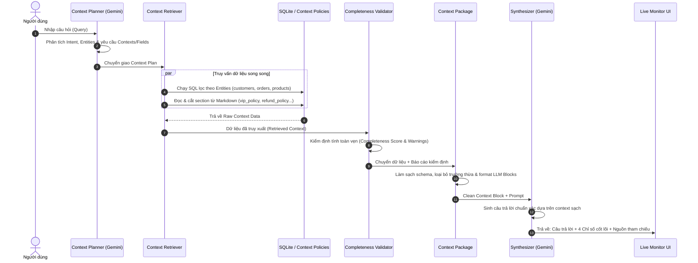

# 🏛️ Vanilla Context Warehouse (Architecture Experiment)

> **Mục tiêu dự án:** Thử nghiệm và hiện thực hóa kiến trúc **Vanilla Context Warehouse** – một hệ thống quản lý, lập kế hoạch, truy xuất và kiểm định ngữ cảnh có cấu trúc cho LLM mà không phụ thuộc vào các framework RAG phức tạp (LlamaIndex/LangChain).

---

## 💡 Tại sao lại cần Context Warehouse?

Trong các hệ thống RAG truyền thống:
- **Vector Search mù quáng (Blind Chunking):** Cắt nhỏ văn bản phi cấu trúc thành các đoạn text ngẫu nhiên, làm mất ngữ cảnh toàn cục và không liên kết được với dữ liệu có cấu trúc (Database).
- **Rủi ro Ảo giác (Hallucination):** LLM nhận dữ liệu không đầy đủ hoặc thiếu các ràng buộc chính sách dẫn đến suy luận sai.
- **Lãng phí Context Window:** Đưa toàn bộ tài liệu dài vào prompt thay vì chỉ trích xuất đúng **section/trường dữ liệu** thực sự cần thiết.

**Context Warehouse** giải quyết vấn đề này bằng cách:
1. **Catalog Metadata:** Đăng ký và quản lý thống nhất cả bảng dữ liệu quan hệ (SQLite/SQL) và văn bản chính sách (Markdown).
2. **Context Planner:** Dùng LLM đóng vai trò Planner để phân tích ý định, bóc tách thực thể và chỉ định chính xác trường dữ liệu / Section cần lấy.
3. **Section-Level Retriever:** Truy vấn SQL chính xác và trích xuất đúng đoạn văn bản trong Markdown.
4. **Completeness Validator:** Tự động đối soát và chấm điểm toàn vẹn ngữ cảnh trước khi tổng hợp câu trả lời.
5. **Context Package:** Đóng gói dữ liệu sạch theo format chuẩn cho LLM.

---

## 📐 Kiến Trúc Hệ Thống (System Architecture)



---

## 🔄 Quy Trình 7 Checkpoints Chi Tiết



---

## 📊 Kết Quả Thực Nghiệm & Đo Lường (Benchmark Metrics)

Dưới đây là kết quả kiểm thử thực tế trên toàn bộ 5 kịch bản (đo lường trực tiếp từ hệ thống):

### 1. Tổng hợp Chỉ số theo từng Kịch bản

| ID | Kịch bản / Câu hỏi | Intent | Nguồn Context Kích Hoạt | Completeness | Local Latency | Tổng Latency (kèm LLM) |
| :--- | :--- | :--- | :--- | :---: | :---: | :---: |
| **CASE 1** | *Khách hàng Nguyễn Văn An muốn kiểm tra đơn 5 và điều kiện hoàn tiền* | `order_lookup` | `customers`, `orders`, `refund_policy` | **100%** | **8.3 ms** | 15.1 s |
| **CASE 2** | *Kiểm tra danh sách đơn hàng của khách hàng Nguyễn Văn An và các sản phẩm đã mua?* | `order_lookup` | `customers`, `orders`, `products` | **100%** | **8.4 ms** | 7.1 s |
| **CASE 3** | *Chính sách giao hàng hỏa tốc 2 giờ có miễn phí cho khách hàng Gold và Platinum không?* | `delivery_inquiry` | `delivery_policy`, `vip_policy` | **100%** | **9.6 ms** | 8.7 s |
| **CASE 4** | *Khách hàng hạng Platinum được đổi trả hàng trong bao lâu và có mất phí không?* | `vip_benefits` | `refund_policy`, `vip_policy` | **100%** | **6.4 ms** | 7.7 s |
| **CASE 5** | *Khách hàng Trần Văn X kiểm tra đơn hàng 9999 có được đổi trả không? (Edge Case)* | `refund_eligibility` | `customers`, `orders`, `refund_policy` | **100%** | **10.2 ms** | 6.4 s |

---

### 2. Phân Rã Thời Gian Thực Thi (Latency Breakdown per Checkpoint)

| Bước | Checkpoint | Thời gian xử lý trung bình | Ghi chú kỹ thuật |
| :---: | :--- | :---: | :--- |
| **CP 1** | Snapshot Catalog & Init | **2.8 ms** | Đọc metadata bảng & quan hệ ngữ nghĩa từ SQLite |
| **CP 2** | Context Planner (AI) | **5,614.4 ms** | Phân tích intent, entities và danh sách sections cần lấy |
| **CP 3** | Context Retriever | **4.5 ms** | Chạy SQL truy vấn bản ghi + Cắt lọc section Markdown |
| **CP 4** | Completeness Validator | **0.7 ms** | Đối soát schema, phát hiện thiếu trường dữ liệu |
| **CP 5** | Context Package & Cleaner | **0.6 ms** | Lọc trường thừa, format prompt blocks tiêu chuẩn |
| **CP 6** | Response Synthesizer (AI) | **3,426.4 ms** | Gemini tổng hợp câu trả lời dựa trên context sạch |
| **CP 7** | Telemetry & Tracer | **0.1 ms** | Tổng hợp log hiệu năng và lưu vết |

> ⚡ **Nhận xét kiến trúc:** Tổng thời gian overhead xử lý nội bộ của Context Warehouse (CP1 + CP3 + CP4 + CP5 + CP7) **chỉ mất ~8.7 ms (< 10ms)**. Phần lớn thời gian còn lại là network round-trip & inference của Gemini API.

---

## 🗂️ Cấu Trúc Thư Mục (Project Layout)

```text
context_warehouse_01/
├── composer/                      # Module điều phối và xử lý Context Warehouse
│   ├── catalog.py                 # Nạp catalog, phân tích section-level từ Markdown
│   ├── planner.py                 # LLM Planner: Lập kế hoạch ngữ cảnh theo intent & entity
│   ├── retriever.py               # Truy vấn database SQLite & trích xuất section Markdown
│   ├── package.py                 # Đóng gói dữ liệu sạch & sinh Prompt Text Block
│   ├── composer.py                # Pipeline Orchestrator kết nối toàn bộ 7 checkpoints
│   ├── tracer.py                  # Đo lường thời gian thực thi (Latency Telemetry)
│   ├── server.py                  # FastAPI Server cung cấp REST API & Web UI
│   └── static/                    # Frontend Dashboard tối giản (Monochrome)
│       ├── index.html             # Giao diện trực quan hoá chỉ số
│       ├── app.css                # CSS đơn sắc trắng-đen, không gradient/icon
│       └── app.js                 # Xử lý tương tác & render dữ liệu
├── context/                       # Kho lưu trữ các tài liệu chính sách (Markdown)
│   ├── vip_policy.md              # Chính sách quyền lợi hội viên VIP
│   ├── refund_policy.md           # Quy định đổi trả & hoàn tiền
│   └── delivery_policy.md         # Quy định giao hàng & phí vận chuyển
├── ultis/                         # Các tiện ích bổ trợ
│   └── validator.py               # Bộ thẩm định tính toàn vẹn ngữ cảnh (Completeness Validator)
├── database.py                    # Khởi tạo & thao tác SQLite Database
├── schema.sql                     # Định nghĩa cấu trúc các bảng DB
├── seed.py                        # Khởi tạo dữ liệu mẫu cho Database & Catalog
├── pyproject.toml                 # Quản lý dependencies dự án với uv
├── warehouse.db                   # File SQLite database
└── README.md                      # Tài liệu dự án
```

---

## 🚀 Hướng Dẫn Cài Đặt & Chạy Nhanh

Dự án sử dụng **[`uv`](https://github.com/astral-sh/uv)** để quản lý môi trường và package tốc độ cao.

### 1. Cấu hình API Key
Tạo file `.env` tại thư mục gốc của dự án:
```bash
GEMINI_API_KEY=your_gemini_api_key_here
```

### 2. Khởi tạo dữ liệu mẫu (Database & Catalog)
```bash
uv run python seed.py
```

### 3. Khởi chạy Server & Giao diện Giám sát
```bash
uv run python composer/server.py
```
*(Hoặc: `uv run uvicorn composer.server:app --reload`)*

Truy cập giao diện tại: **[`http://localhost:8000`](http://localhost:8000)**

---

## 🖥️ Giao Diện Giám Sát (Monochrome Frontend)

Giao diện được thiết kế theo phong cách đơn sắc (Black & White Technical UI), tập trung vào **4 chỉ số cơ bản & thiết yếu nhất**:

1. **Completeness Score:** Tỷ lệ % độ đầy đủ của ngữ cảnh (`ĐẦY ĐỦ - 100%`, `TƯƠNG ĐỐI - 70%`, hoặc cảnh báo thiếu dữ liệu).
2. **Latency:** Thời gian thực thi toàn bộ chu trình tính bằng giây.
3. **Intent & Entities:** Intent và thực thể khách hàng/đơn hàng được Planner nhận diện.
4. **Context Sources:** Danh sách bảng DB và tệp chính sách đã trích xuất.
5. **Synthesized Answer:** Câu trả lời Markdown trực tiếp từ AI.
6. **Retrieved Context Inspection:** Đối soát các bản ghi DB hoặc đoạn văn bản chính sách đã dùng.
7. **Debug Logs (Collapsible):** Log thời gian từng checkpoint ms và JSON schema thô.

---

## 🛠️ Quản lý Dependencies với `uv`

- **Thêm package mới:** `uv add <package_name>`
- **Xoá package:** `uv remove <package_name>`
- **Đồng bộ môi trường:** `uv sync`
- **Chạy script với môi trường ảo:** `uv run python <script.py>`
